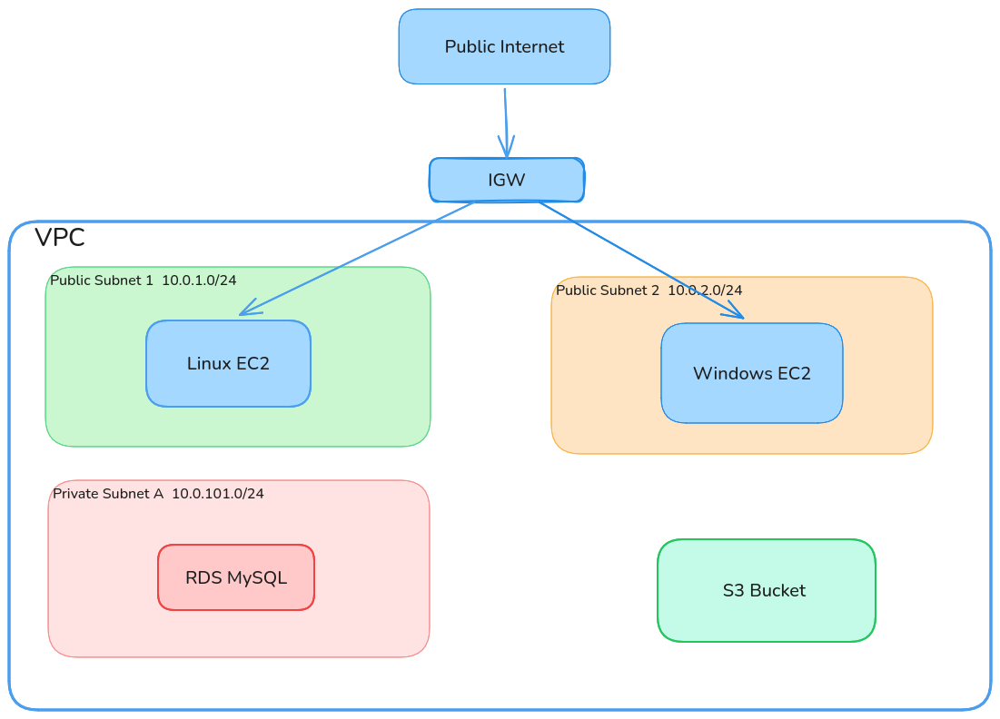

## Structure

```
iac-infra-deploy/
├── modules/
│   ├── networking/     # VPC, Subnets, IGW, NAT, SGs, NACLs
│   ├── compute/        # EC2 Instances
│   ├── database/       # RDS + DB Subnet Group
│   └── s3/             # S3 Buckets
├── envs/
│   └── example/        # Copy this to get started
└── README.md
```

## Cloud Architecture



---

## Prerequisites

1. Install [Terraform](https://developer.hashicorp.com/terraform/downloads) >= 1.5.0
2. Install the [AWS CLI](https://docs.aws.amazon.com/cli/latest/userguide/getting-started-install.html)
3. Create an IAM user in AWS Console → IAM → Users → Security Credentials → Create Access Key
4. Configure your credentials:

```bash
aws configure
# AWS Access Key ID: AKIA...
# AWS Secret Access Key: wJal...
# Default region: us-east-1
# Default output format: json
```

---

## Quick Start

```bash
# 1. Clone and create your environment
git clone https://github.com/your-org/iac-infra-deploy.git
cd iac-infra-deploy
cp -r envs/example envs/jude
cd envs/jude

# 2. Configure your module variables
cp terraform.tfvars.example terraform.tfvars
# Edit terraform.tfvars with your values

# 3. Deploy networking first
terraform init
terraform plan
terraform apply

# 5. Tear down when done
terraform destroy
```

---

## Deploy RDS Example

After networking is running, uncomment the database block in `main.tf`, add these to your `terraform.tfvars`:

```hcl
db_name     = "appdb"
db_username = "admin"
db_password = "Str0ngPassw0rd!"
db_port     = 3306
```

Then apply:

```bash
terraform plan    # Check what RDS will create
terraform apply   # Deploy the database
```

RDS deploys into the **private subnets** — only accessible from within the VPC (your EC2 instances).

---

## Modules

### `modules/networking`

VPC, public/private subnets, IGW, NAT Gateway, route tables, security groups (web + RDP), NACLs, and optional S3 VPC endpoint.

| Variable | Description | Default |
|---|---|---|
| `project_name` | Resource name prefix | — |
| `vpc_cidr` | VPC CIDR block | `10.0.0.0/16` |
| `availability_zones` | AZs to deploy into | — |
| `public_subnet_cidrs` | Public subnet CIDRs | — |
| `private_subnet_cidrs` | Private subnet CIDRs | — |
| `enable_nat_gateway` | Create NAT Gateway | `true` |
| `allowed_ssh_cidr` | SSH access CIDR | `0.0.0.0/0` |
| `allowed_rdp_cidr` | RDP access CIDR (Windows) | `0.0.0.0/0` |
| `enable_s3_endpoint` | S3 VPC Gateway Endpoint (free) | `false` |

### `modules/compute`

EC2 instances with optional key pair and user data. Deploy multiple blocks for different roles (Linux/Windows).

| Variable | Description | Default |
|---|---|---|
| `instance_count` | Number of instances | `1` |
| `instance_type` | EC2 instance type | `t3.micro` |
| `ami_id` | AMI ID (empty = Amazon Linux 2023) | `""` |
| `subnet_ids` | Target subnet(s) | — |
| `security_group_ids` | Security groups to attach | — |
| `public_key` | SSH public key material | `""` |
| `associate_public_ip` | Assign public IP | `true` |
| `root_volume_size` | Root EBS volume size (GB) | `20` |

### `modules/database`

Single RDS instance (no multi-AZ), DB subnet group, and dedicated security group.

| Variable | Description | Default |
|---|---|---|
| `engine` | DB engine | `mysql` |
| `engine_version` | Engine version | `8.0` |
| `instance_class` | RDS instance class | `db.t3.micro` |
| `allocated_storage` | Storage in GB | `20` |
| `db_name` | Database name | — |
| `db_username` | Master username | — |
| `db_password` | Master password | — |

### `modules/s3`

S3 bucket with versioning, encryption, public access blocking, IAM-restricted bucket policy, and optional lifecycle rules.

| Variable | Description | Default |
|---|---|---|
| `bucket_suffix` | Suffix for auto-generated bucket name | `bucket` |
| `enable_versioning` | Enable bucket versioning | `true` |
| `sse_algorithm` | Encryption (`AES256` / `aws:kms`) | `AES256` |
| `block_public_access` | Block all public access | `true` |
| `bucket_policy_principals` | IAM ARNs allowed to read (empty = no policy) | `[]` |
| `force_destroy` | Allow destroy with objects inside | `false` |
| `enable_lifecycle_rule` | Enable Glacier transition + expiration | `false` |

---

## Multi-User Workflow

Each person works in `envs/<name>/`. State is local and gitignored — no conflicts.

### Shared VPC (one person owns networking)

**Linux - EC2:**

1. Deploy networking + compute
2. Run `terraform output` and share the values with Person B:

```bash
terraform output
```

**Other Modules:**

1. Comment out the networking module in `main.tf`
2. Add Person A's output values to your `terraform.tfvars`:

```hcl
existing_vpc_id            = "vpc-0abc123"   # Will be provided by Linux
existing_subnet_id         = "subnet-222"    # Public subnet 2
existing_security_group_id = "sg-999"        # RDP SG
```

3. Reference these variables in your compute block instead of `module.networking.*`
4. Run `terraform apply`

---
